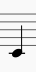
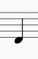
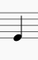
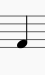
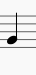
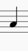
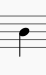
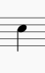
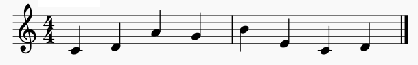

## Abstract

This project shows how a wide number of melodies can be automatically
derived from public domain content, highlighting the problems of music
copyright law and the need to rethink it.

## Disclaimer

This article DOES NOT CONTAIN LEGAL ADVICE. It is a reflection that
provides a computational argument to show some aspects of copyright law
and conceptualization that need attention.

## Introduction

In his [TED Talk](https://www.youtube.com/watch?v=rjpTBHjeZ_0), Damien
Riehl explains how melody copyright causes unnecessary conflicts and
lawsuits. In the current situation, artists can publish a song and only
realize that it's already copyrighted when they are sued. That is like
walking "on a \[melodic\] minefield" (14:30). Many musicians are in
danger of being sued by companies that have larger resources, and "that
is not fair." In his words: "the copyright system is broken and it needs
updating" (5:57)

Considering this, Riehl and his colleague Noah Rubin started a project
to bring attention to this matter. Given that any melody that is written
can be argued to produce copyright, they have written a program that
generates every possible melody and they stored them all in a hard
drive. Since they have copyrighted all melodies (all that were not
copyrighted before them), their plan is to release them all into the
public domain, so from this point on, artists can freely use those
remaining melodies without worries.

Riehl refers to a case where Katy Perry lost a lawsuit. The plaintiff
argued that they had more than 3 million views, therefore, Perry most
probably had heard that song before (15:00). Accordingly, Riehl proposes
that, if his talk reaches 3 million views, future lawsuits will have to
consider the fact that everyone music company knows that every melody is
copyrighted, and that will force the music industry to rethink copyright
and move towards fairer and more reasonable ways to resolve creativity
conflicts.
	
This project aims to contribute more visibility and a new perspective to
this matter.

## Methodology

This project is inspired by Riehl's idea, but it follows a complementary
approach. I want to show that most melodies can be automatically derived
from public-domain content.

In Riehl's argument, a "melody" is at least 12 notes long (7:30). He
considers only the notes contained in the diatonic scale. This project
uses a narrower definition, and considers melodies formed by eight
notes. This makes my argument weaker, but it can serve as a starting
point for further work.

The argument has two parts. First, I show that any given piece of
content, stored as a digital file, can be converted to a melody, or a
sequences of melodies. Then I show that every 8-note melody can be found
inside existing public domain content.

Therefore, if we encoded this public-domain content into melodies, every
one of those melodies would be automatically derived from public domain,
and arguably also in the public domain. But, if we can find "all"
melodies among these, can they be copyrighted? I leave that discussion
to experts.

### Converting any file or binary sequence into a melody 

Any content stored in a digital device is encoded in binary form, as a
series of ones and zeros.

For example, if we have a very short text file, that only contains the
text "Hi!", it will be encoded as follows, according to the ASCII
standard:

"Hi!"

'H' → 72 → 0100 1000

'i' →105 → 0110 1001

'!' → 33 → 0010 0001

Note that, according to westering conventions of writing numbers, in the
example above the least significant bits are written to the right. In
this project, however, the algorithm proposed starts consuming the least
significant bits. Therefore, it is (or it seems to me) more intuitive to
write them left to right (least significant bits to the left). If we
arrange the data accordingly, the result is as follows:

 | -------------| ----------| ----------| ----------|
 | Character    | H         | i         | !         |
 | Byte index   | 0         | 1         | 2         |
 | Bit indices  | 01234567  | 01234567  | 01234567  |
 | Bit values   | 00010010  | 10010110  | 10000100  |
 | -------------| ----------| ----------| ----------|

Now, we look for a way to convert a binary sequence to a sequence of
notes. Given that we consider one octave of the diatonic scale, we have
8 notes. Any set of eight elements can be encoded with variations of
three ones and zeroes. Therefore, we will split the bit sequence into
groups of three bits, and we obtain the following:

000 100 101 001 011 010 000 100

Now, we consider the following encoding:

000 →
{width="0.679cm"
height="1.356cm"}

100
→{width="0.848cm"
height="1.109cm"}

010
→{width="0.949cm"
height="1.252cm"}

110 →
{width="1.023cm"
height="1.291cm"}

001 →
{width="0.935cm"
height="1.376cm"}

101 →
{width="1.041cm"
height="1.508cm"}

011 →
{width="1.094cm"
height="1.441cm"}

111 →
{width="1.201cm"
height="1.498cm"}

If we apply this encoding to the example bit sequence, and we obtain
this melody:

{width="17cm"
height="2.649cm"}

We can follow the same scheme to encode any file, with any length (if
the number of bits is not a multiple of three, we fill with zeros at the
end).

This project includes a program (`melodize.py`, see the appendix) that
actually does that. This program takes any binary file as input, reads
it in groups of three bytes, then encodes and writes each one as melody
in a MIDI file.

## Looking for "all" possible melodies

Given that we encode each note as three bits, an 8-notes-long melody is
formed by 3·8 = 24 bits, or three bytes. Therefore, there is one and
only one of such melodies for each possible three-byte sequence, and
vice-versa.

Therefore, if we prove that a given binary file contains all possible
3-byte variations, and then convert this file into a MIDI melody , we
know that every possible (eight-note long) melody is present in the
output.

To find out, we can just make a program that reads a binary file, and
checks that every three-byte combination is present in it. This will
have a list of flags, one for each possible three-byte variation. At the
beginning, all the flags are deactivated. When a given variation is
found, its flag is activated. Finally, when the program finishes reading
the file, the flags are counted.

What is the number of all 3-byte possible sequences? Or what is the
same, what's the number of all possible 8-long melodies of one octave
range (8 notes)? This can be considered 8-position variations with
repetition of 8 elements, which is VR~8,8~ = 8^8^ = 16,777,216
(alternatively, if we expand each note as a three bit sequence, we have
3·8 = 24 positions, and therefore VR~2,24~ = 2^24^ = 16,777,216).

So, to sum up, the program counts all different three-byte variations
present in the input file. If the number is 16,777,216 (the maximum), we
know that if we convert that file to MIDI using melodies, every 8-note
melody will be contained in the output.

Since this is an automatic process, if the original file is public
domain, it is left to the reader to reflect on the status of the
melodies.

## Looking for the files

Are there files that are public domain and contain all these variations?

We can look for a list of public domain movies. We consider movies
because video media tend to make bigger files. In Wikipedia we can find
a list of movies in the public domain:
<https://en.wikipedia.org/wiki/List_of_films_in_the_public_domain_in_the_United_States>

Using `countvar`, we find that the following files contain all possible
three-byte variations. Therefore, if we apply `melodize.py` on any of
them, we will obtain all possible eight-note melodies derived
automatically from a piece of public-domain content.

  --------------------------------------------------------------------------------------------------------------------------------------------- ------
  Movie                                                                                                                                         Year
  [Check and Double Check](https://upload.wikimedia.org/wikipedia/commons/5/5e/Check_and_Double_Check_(1930)_by_Melville_W._Brown.webm)         1930
  [Danger Lights](https://upload.wikimedia.org/wikipedia/commons/2/26/Danger_Lights,_1930,_original_version,_HR.webm)                           1930
  [Dixiana](https://upload.wikimedia.org/wikipedia/commons/e/ee/Dixiana_(1930)_by_Luther_Reed.webm)                                             1930
  [Half Shot at Sunrise](https://upload.wikimedia.org/wikipedia/commons/d/d5/Half_Shot_at_Sunrise_(1930)_by_Paul_Sloane.webm)                   1930
  [Hook, Line and Sinker](https://upload.wikimedia.org/wikipedia/commons/9/91/Hook,_Line_and_Sinker_(1930)_by_Edward_F._Cline.webm)             1930
  [The Front Page](https://upload.wikimedia.org/wikipedia/commons/9/91/The_Front_Page_(1931).webm)                                              1931
  [Bird of Paradise](https://upload.wikimedia.org/wikipedia/commons/d/dc/Bird_of_Paradise_(1932).webm)                                          1932
  [Becky Sharp](https://upload.wikimedia.org/wikipedia/commons/0/0c/Becky_Sharp_(1935).webm)                                                    1935
  [Disorder in the Court](https://upload.wikimedia.org/wikipedia/commons/e/ed/Three_Stooges_Disorder_In_The_Court_(Blu-ray_restoration).webm)   1936
  [Gulliver\'s Travels](https://upload.wikimedia.org/wikipedia/commons/8/87/Gullivers_Travels_(1939).webm)                                      1939
  [Made for Each Other](https://upload.wikimedia.org/wikipedia/commons/d/d4/Made_for_Each_Other_(1939).webm)                                    1939
  [The Flying Deuces](https://upload.wikimedia.org/wikipedia/commons/0/05/The_Flying_Deuces_(1939)_by_A._Edward_Sutherland.webm)                1939
  [His Girl Friday](https://upload.wikimedia.org/wikipedia/commons/d/df/His_Girl_Friday_(1940)_by_Howard_Hawks.webm)                            1940
  [Meet John Doe](https://upload.wikimedia.org/wikipedia/commons/2/2b/Meet_John_Doe.webm)                                                       1941
  [Captain Kidd](https://upload.wikimedia.org/wikipedia/commons/9/9a/Captain_Kidd_(1945)_by_Rowland_V._Lee.webm)                                1945
  [Detour](https://upload.wikimedia.org/wikipedia/commons/b/b7/Detour_(1945)_by_Edgar_G._Ulmer.webm)                                            1945
  [The Chase](https://upload.wikimedia.org/wikipedia/commons/6/6d/The_Chase_(1946)_by_Arthur_Ripley.webm)                                       1946
  [The Strange Love of Martha Ivers](https://upload.wikimedia.org/wikipedia/commons/1/1f/The_Strange_Love_of_Martha_Ivers_(1946).webm)          1946
  [The Stranger](https://upload.wikimedia.org/wikipedia/commons/9/94/The_Stranger_(1946)_by_Orson_Welles.webm)                                  1946
  [At War with the Army](https://upload.wikimedia.org/wikipedia/commons/1/17/At_War_With_The_Army.webm)                                         1950
  [Cyrano de Bergerac](https://upload.wikimedia.org/wikipedia/commons/a/a1/Cyrano_de_Bergerac_(1950).webm)                                      1950
  [Go for Broke!](https://upload.wikimedia.org/wikipedia/commons/0/06/Go_For_Broke!_(1951)_by_Robert_Pirosh.webm)                               1951
  [Beat the Devil](https://upload.wikimedia.org/wikipedia/commons/c/c1/Beat_the_Devil_(H._Bogart_-_G._Lollobrigida,_1953)_HD.webm)              1953
  [The Hitch-Hiker](https://upload.wikimedia.org/wikipedia/commons/f/fa/The_Hitch-Hiker.webm)                                                   1953
  [Salt of the Earth](https://upload.wikimedia.org/wikipedia/commons/6/69/Salt_of_the_Earth_(1954)_by_Herbert_J._Biberman.webm)                 1954
  [Suddenly](https://upload.wikimedia.org/wikipedia/commons/6/66/Suddenly_(1954).webm)                                                          1954
  [Attack of the Giant Leeches](https://upload.wikimedia.org/wikipedia/commons/c/c8/Attack_of_the_Giant_Leeches.webm)                           1959
  [House on Haunted Hill](https://upload.wikimedia.org/wikipedia/commons/b/bb/House_on_Haunted_Hill_(1959)_by_William_Castle.webm)              1959
  [The Little Shop of Horrors](https://upload.wikimedia.org/wikipedia/commons/2/20/The_Little_Shop_of_Horrors_(1960)_by_Roger_Corman.webm)      1960
  [Carnival of Souls](https://upload.wikimedia.org/wikipedia/commons/6/69/Carnival_of_Souls_(1962)_by_Herk_Harvey.webm)                         1962
  [McLintock!](https://upload.wikimedia.org/wikipedia/commons/7/77/McLintock!_(1963).webm)                                                      1963
  [Night of the Living Dead](https://upload.wikimedia.org/wikipedia/commons/2/24/Night_of_the_Living_Dead_(1968).webm)                          1968
  --------------------------------------------------------------------------------------------------------------------------------------------- ------

## Conclusion and future work

In this article, we recalled Damien Riehl's TED Talk, that shows why
music copyright is problematic today, and needs to be fixed. Riehl and
his colleague Noah Rubin created a program that writes "every possible
melody". This would arguably make every melody copyrighted, but their
real aim is to call attention to this problem and release all the the
melodies they can into the public domain, to preserve the ability of
musicians to keep writing melodies.

Inspired by their idea, this project shows how many melodies can be
automatically derived from public domain content. This is a
complementary approach that reinforces Riehl's point about the necessity
to rethink copyright.

Although this project is not as comprehensive as Riehl's (I consider
8-notes-long melodies, while he works with 12 notes), it shows that it
is possible to create encodings that derive melodies automatically from
public-domain content, which is an argument in favor of considering
those melodies public domain too.

Future projects can explore other ways of encoding (or decoding)
melodies. There are at least two possible approaches. We can continue
this approach and use this or other encodings to count how many melodies
are present in existing public domain content. Alternatively, we can
define encodings that let us search for given melody in existing
content.

## Appendix. Using the programs

### Countvar

This program was developed in pure C, on Ubuntu. To compile the project,
use the `make` command.

```
$ make
```

To count the variations contained in a file, use `countvar`:

```
$ countvar -i <input_filename> [ -o <flag_filename>]
```

Use the option `-o` if you want to store the list of flags as a file
(the output file will be 2 MB long always).

### Pymelodize

To convert a file to melodies, use the program `melodize.py`. It requires
Python 3 and the `midiutil` package.

```
$ python3 melodize.py
```

**Warning! The program melodize.py produces a set of files that multiply
the size of the input file by a factor of almost *40 times*. If you use
big files as input (such as video files), you risk running out of disk
space. For example, if your input file is 1 GB, the created files will
take almost 40 GB of your disk space. It is _your responsibility_ to
check that you have enough disk space if you choose to run this program.**

Thank you for reading.

Please report comments or bugs to andres.glez.sj (at) gmail (com).
